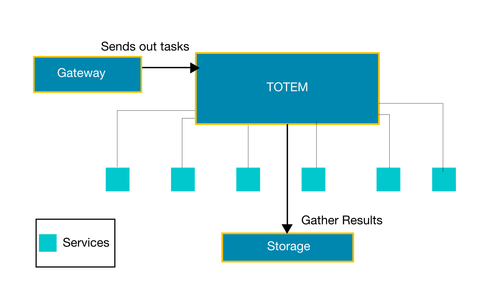
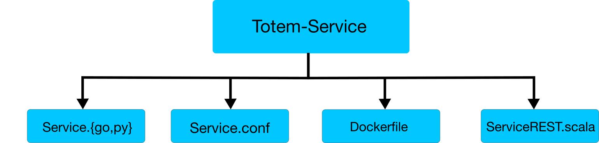

# Creating a New Static-Service.

## Introduction

_Figure 4.1 Holmes analysis overivew._

When a user wants to perform analysis with Totem, the user first has to upload his sample to Holmes-Storage because this is where Totem looks for the sample. The user tasks analysis through Holmes-gateway specifying list of Services with which the file has to be analysed. The Totem takes the sample and distribute the analysis work to its respective static Services. The services perform analysis and returns the results to Totem. Totem then combines all the results and storages in Storage.

Now we are going to discuss to how to create those Services(_those tiny pods in the above figure_) which does Static-anlaysis. Static-analysis services does not take large time for analysis. To create a new Service, you need to first the select the `analyser library`( like [passivetotal](https://www.passivetotal.org), [pev](http://pev.sourceforge.net), [pdfparse](https://blog.didierstevens.com/programs/pdf-tools/)) which does analysis and learn how to work with them. This will let you know the important commands that will be used for analysis. To make this `analyser library` be able to interact with Totem,create a Service in your language of choice that takes a file and send to analyser library and parse the result to a JSON. And send this JSON back to Totem.

## Template

This tutorial will show you how to create a new static analysis service For Holmes.

I’ll introduce the mechanism of the Service, and explain how to organize various files in the Service.

_Figure 4.2 Template mechanism_

A minimal template has 4 files. `Service.{go,py}`, `Service.conf`, `serviceREST.scala`, `Dockerfile`,

### [`Dockerfile`](./Dockerfile.md)
This file containerises the entire application.

### [`Service.{go,py}`](./service.lang.md)
In this file you create Server which can accessed through a port and also you write the logic for how to send `raw_file` to analysis library and convert the ouput to a JSON.

All the services are RESTful applications. So create a webserver with "/info" and "/analyze" directories. 

1. `/info` directory displays general info and discription of the Servie on how to use it.( refer [Info-Output](./infooutput.md) )
2. `/analyze` directory analyses the raw data provided.And has to provide following functionalities
    1. Scan the URL and get the `raw_file` to be analysed from the filesystem or FTP ( refer [URL API Scheme](./urlapischeme.md) )
	2. Read the configuration file ( Refer [Read configuration scheme](./readconfiguration.md) )
	3. Send the `raw_file` to `analyser library` and parse output the result.
	4. Raise Appropriate HTTP Error Code ( refer [HTTP error codes](./Errorcodes.md) )
	5. Fetch the result and fit into a JSON file

### [`Service.conf`](./Service.conf.md)
This file contains the essential configuration settings for the service.

### [`ServiceREST.scala`](./ServiceREST.scala.md)
This file interacts with Totem and connects the TOTEM with the Service.

## File type vs Non-file type.

Now lets discuss about the Generic Template. This template demonstrates how a service is created. This template is language independed.

In general, there are 2 kinds of services.
1. File types
	These type of services does analysis on files and produces appropriate result.
2. Non File Types
	These type of services does analysis on non-file types like IPv4/6, Domain.

The only difference while create services occurs in step 2.1 and step 2.3

## DEMO
 Refer [Analysis with Holmes - DEMO](./workingexample.md)

 ## Troubleshooting

Refer [Troubleshooting](./troubleshooting.md)
 ## Appendix

* Organisation - any group of people who wants to do analysis.
* Sources - Source is just a string which identifes the set of samples.
* raw_file - The file on which you want to perform analysis
* analyser library - The core library which the Service uses to perform analysis
