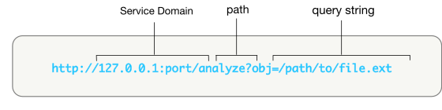

### URL API Scheme

This docs explains how the the URL of the /analyze directory should look like.
The raw data file is served to the Service using URL parametres. 

1. `Service domain` is of the form `address:port`. In the above example, the name of the source is `example.com` it could also be localhost and `port` through which it can be accessible.
2. The `path` consists directory information required. In this example, `/analyze` is the route through which raw_file is passed and sevice is logic is invoked.
3. Parameters are added to the query string of the URL. In the above example, the query string begins  `?obj=`. These parameter dictate location of the raw_file.

